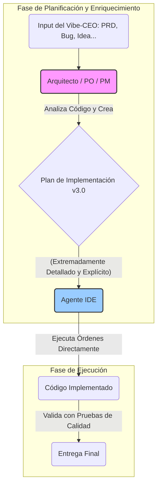

# Base de Conocimiento BMad - Método de Desarrollo Ágil Impulsado por IA

## Visión General del Método BMad

El Método BMad (Breakthrough Method of Agile AI-driven Development) es un enfoque revolucionario que eleva el "vibe coding" a planificación avanzada de proyectos para asegurar que los agentes desarrolladores puedan iniciar y completar proyectos avanzados con guía muy explícita.

### Principios Fundamentales

1. **Desarrollo Impulsado por IA:** Utilizar agentes de IA especializados para cada aspecto del proceso de desarrollo
2. **Planificación Explícita:** Crear documentación detallada y específica que guíe el desarrollo
3. **Proceso Ágil Estructurado:** Combinar flexibilidad ágil con estructura rigurosa
4. **Calidad por Diseño:** Integrar calidad en cada paso del proceso
5. **Colaboración Humano-IA:** Optimizar la colaboración entre humanos y agentes de IA

## Arquitectura de Agentes

### Orquestador BMad
- **Propósito:** Agente maestro que puede transformarse en cualquier agente especializado
- **Capacidades:** Gestión de configuración, cambio de personas, coordinación de tareas
- **Ventajas:** Simplifica la configuración, mantiene contexto, facilita transiciones

### Agentes Especializados

#### Product Owner (PO)
- **Responsabilidades:** Gestión de requisitos, creación de PRDs, definición de historias de usuario
- **Fortalezas:** Conexión entre negocio y desarrollo, aseguramiento de calidad de documentación
- **Artefactos:** PRDs, épicas, historias de usuario, criterios de aceptación

#### Arquitecto
- **Responsabilidades:** Diseño de sistemas, decisiones técnicas, documentación arquitectónica
- **Fortalezas:** Visión técnica holística, optimización de rendimiento y escalabilidad
- **Artefactos:** Documentos de arquitectura, diagramas de sistema, decisiones técnicas

#### Desarrollador
- **Responsabilidades:** Implementación de código, pruebas, integración
- **Fortalezas:** Traducción de especificaciones a código funcional, mejores prácticas
- **Artefactos:** Código fuente, pruebas, documentación técnica

#### Scrum Master
- **Responsabilidades:** Gestión de proceso, facilitación, generación de historias
- **Fortalezas:** Optimización de flujo de trabajo, resolución de impedimentos
- **Artefactos:** Planes de sprint, reportes de progreso, métricas de equipo

#### Analista
- **Responsabilidades:** Investigación, análisis de requisitos, lluvia de ideas
- **Fortalezas:** Recopilación de información, análisis de mercado, validación de supuestos
- **Artefactos:** Reportes de investigación, análisis de mercado, resúmenes de proyecto

#### Arquitecto de Diseño
- **Responsabilidades:** Diseño UX/UI, especificaciones de frontend, experiencia de usuario
- **Fortalezas:** Optimización de experiencia de usuario, diseño visual, usabilidad
- **Artefactos:** Wireframes, especificaciones UI/UX, guías de diseño

#### Product Manager
- **Responsabilidades:** Estrategia de producto, roadmap, gestión de stakeholders
- **Fortalezas:** Visión de producto, alineación estratégica, gestión de prioridades
- **Artefactos:** Estrategias de producto, roadmaps, análisis competitivo

## Flujo de Trabajo BMad

### Fase 1: Ideación y Análisis
1. **Lluvia de Ideas:** Generación de conceptos y validación inicial
2. **Investigación:** Análisis de mercado, competencia y viabilidad
3. **Resumen de Proyecto:** Documentación inicial de objetivos y alcance

### Fase 2: Definición de Producto
1. **Creación de PRD:** Documento comprensivo de requisitos del producto
2. **Definición de Épicas:** Estructuración de trabajo en incrementos de valor
3. **Historias de Usuario:** Especificación detallada de funcionalidades

### Fase 3: Diseño Técnico
1. **Arquitectura de Sistema:** Diseño técnico de alto nivel
2. **Especificaciones UI/UX:** Diseño de experiencia de usuario (si aplica)
3. **Decisiones Técnicas:** Selección de tecnologías y patrones

### Fase 4: Implementación
1. **Desarrollo Iterativo:** Implementación por sprints/iteraciones
2. **Pruebas Continuas:** Testing integrado en el proceso de desarrollo
3. **Integración Continua:** Despliegue y validación continua

### Fase 5: Entrega y Evolución
1. **Lanzamiento MVP:** Entrega del producto mínimo viable
2. **Feedback y Análisis:** Recopilación de datos de usuario
3. **Iteración Continua:** Mejora basada en feedback y métricas

## Artefactos Clave

### Documentos de Planificación
- **Project Brief:** Resumen ejecutivo del proyecto
- **PRD (Product Requirements Document):** Especificación completa del producto
- **Architecture Document:** Diseño técnico del sistema
- **UI/UX Specifications:** Especificaciones de diseño de interfaz

### Documentos de Desarrollo
- **User Stories:** Historias de usuario con criterios de aceptación
- **Technical Specifications:** Especificaciones técnicas detalladas
- **API Documentation:** Documentación de interfaces
- **Test Plans:** Planes y casos de prueba

### Herramientas de Proceso
- **Checklists:** Listas de verificación para asegurar calidad
- **Templates:** Plantillas para documentos estándar
- **Tasks:** Tareas específicas ejecutables por agentes
- **Configuration:** Configuración de agentes y procesos

## Mejores Prácticas

### Gestión de Calidad
1. **Revisiones Iterativas:** Revisión continua de artefactos
2. **Validación Cruzada:** Verificación entre múltiples agentes
3. **Checklists Comprensivas:** Uso de listas de verificación detalladas
4. **Feedback Loops:** Ciclos de retroalimentación rápidos

### Colaboración Efectiva
1. **Comunicación Clara:** Documentación explícita y comprensible
2. **Handoffs Estructurados:** Transiciones claras entre fases
3. **Context Preservation:** Mantenimiento de contexto entre agentes
4. **Escalation Paths:** Rutas claras para resolución de problemas

### Optimización de Proceso
1. **Automatización:** Automatización de tareas repetitivas
2. **Standardización:** Uso de plantillas y patrones estándar
3. **Métricas:** Medición y optimización continua
4. **Adaptabilidad:** Flexibilidad para ajustar el proceso

## Configuración y Personalización

### Configuración de Agentes
- **Personalidades:** Personalización de comportamiento de agentes
- **Capacidades:** Habilitación/deshabilitación de funcionalidades
- **Workflows:** Definición de flujos de trabajo específicos
- **Integration:** Integración con herramientas externas

### Adaptación a Proyectos
- **Scaling:** Adaptación a proyectos de diferentes tamaños
- **Technology Stacks:** Soporte para diferentes tecnologías
- **Industry Domains:** Adaptación a diferentes dominios de negocio
- **Team Structures:** Flexibilidad para diferentes estructuras de equipo

## Métricas y KPIs

### Métricas de Proceso
- **Tiempo de Ciclo:** Tiempo desde ideación hasta entrega
- **Calidad de Artefactos:** Puntuación de checklists y revisiones
- **Eficiencia de Handoffs:** Tiempo y calidad de transiciones
- **Rework Rate:** Frecuencia de retrabajos y correcciones

### Métricas de Producto
- **Time to Market:** Tiempo hasta lanzamiento
- **Feature Completeness:** Completitud de funcionalidades
- **User Satisfaction:** Satisfacción del usuario final
- **Technical Debt:** Deuda técnica acumulada

## Casos de Uso Comunes

### Desarrollo de Aplicaciones Web
- **Frontend:** SPAs, PWAs, aplicaciones móviles web
- **Backend:** APIs REST, microservicios, serverless
- **Full Stack:** Aplicaciones completas end-to-end

### Sistemas Empresariales
- **CRM/ERP:** Sistemas de gestión empresarial
- **Analytics:** Plataformas de análisis de datos
- **Integration:** Sistemas de integración y middleware

### Productos Digitales
- **SaaS:** Software como servicio
- **Marketplaces:** Plataformas de comercio
- **Content Management:** Sistemas de gestión de contenido

## Troubleshooting Común

### Problemas de Configuración
- **Agent Loading:** Problemas cargando configuración de agentes
- **Task Resolution:** Errores en resolución de rutas de tareas
- **Template Issues:** Problemas con plantillas y formatos

### Problemas de Proceso
- **Context Loss:** Pérdida de contexto entre agentes
- **Incomplete Handoffs:** Transiciones incompletas entre fases
- **Quality Issues:** Problemas de calidad en artefactos

### Soluciones Recomendadas
- **Validation Checks:** Verificaciones de validación regulares
- **Backup Strategies:** Estrategias de respaldo y recuperación
- **Escalation Procedures:** Procedimientos de escalación claros

## Flujo de Trabajo de Enriquecimiento: Del Requisito al Código

El método BMAD utiliza una cadena de enriquecimiento para asegurar la máxima calidad en los planes de implementación. El flujo es: **Arquitecto -> PO/PM -> Agente IDE**.

1.  El **Arquitecto** recibe un requisito (PRD, bug) y produce las **Especificaciones Técnicas** explícitas.
2.  El **PO/PM** recibe el requisito y las especificaciones técnicas, y los integra en un **Plan de Implementación** detallado.
3.  El **Agente IDE** recibe el plan y lo **ejecuta** sin ambigüedades.

