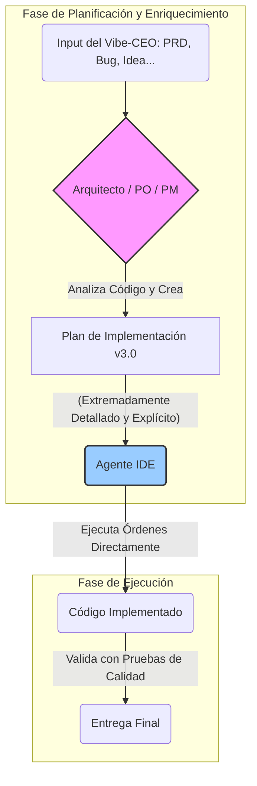

# Registro de Cambios y Mejoras del Sistema BMAD

*   **Fecha:** 7 de junio de 2025
*   **Versión:** v3.1 (Refactorización de Planificación)
*   **Participantes:** Vibe-CEO (Usuario), Sarah (PO de BMAD)
*   **Artefacto ID:** `bmad-sessions/2025-06-07-refactor-planificacion-ide.md`

## Resumen Ejecutivo

Este documento detalla la refactorización estratégica del proceso de generación de planes de implementación dentro del sistema BMAD. A raíz de un análisis colaborativo, se identificó una oportunidad crítica para reducir la carga cognitiva del agente IDE y aumentar la robustez de los planes. Se ha rediseñado el flujo de trabajo para asegurar que todas las decisiones de diseño técnico sean tomadas por los agentes de planificación (Arquitecto, PO, PM). Los cambios incluyen la consolidación de tareas y plantillas, y la formalización de un flujo de trabajo de "enriquecimiento de artefactos". El resultado es un sistema más simple, eficiente y fiable.

## 1. Problema Estratégico Abordado

El análisis inicial reveló que el proceso de planificación, aunque detallado, corría el riesgo de delegar decisiones de diseño implícitas al agente IDE. Los planes podían contener "consideraciones" en lugar de "directivas" explícitas para aspectos no funcionales como seguridad, rendimiento y escalabilidad. Esto aumentaba la carga cognitiva del agente ejecutor y creaba ambigüedad, yendo en contra del principio fundamental de BMAD de proporcionar planes inequívocos.

## 2. Flujo de Trabajo Refinado: La Cadena de Enriquecimiento

Para solucionar el problema, se ha formalizado un flujo de trabajo de **enriquecimiento de artefactos**. Este flujo asegura que el plan final entregado al agente IDE sea el producto de la experiencia combinada de múltiples roles especializados.

**El Flujo Aprobado:** `Arquitecto -> PO/PM -> Agente IDE`

1.  El **Arquitecto** analiza los requisitos (PRD, bug, etc.) y genera las **Especificaciones Técnicas explícitas**.
2.  El **PO/PM** fusiona los requisitos funcionales con las especificaciones técnicas en un **Plan de Implementación v3.0** único y detallado.
3.  El **Agente IDE** recibe y ejecuta el plan sin necesidad de interpretación o diseño.

## 3. Cambios Concretos Implementados

Para materializar este nuevo flujo, se han realizado los siguientes cambios en el sistema BMAD:

### 3.1. Plantillas (`templates/`)

*   **CREADO:** `templates/plantilla-plan-implementacion-maestra.md`
    *   **Propósito:** Una única plantilla robusta que reemplaza a las dos anteriores. Incluye secciones dedicadas para las directivas técnicas del arquitecto y los nuevos criterios de verificación.
*   **ELIMINADOS:**
    *   `templates/plantilla-plan-implementacion-solucion-generica.md`
    *   `templates/plantilla-implementacion-directa-solucion.md`

### 3.2. Tareas (`tasks/`)

*   **CREADO:** `tasks/crear-plan-de-implementacion.md`
    *   **Propósito:** Tarea única y consolidada que guía al PO/PM en el uso de la nueva plantilla maestra.
*   **MODIFICADO:** `tasks/crear-arquitectura.md`
    *   **Propósito:** Se ha añadido lógica contextual para que el Arquitecto pueda manejar diferentes tipos de solicitudes (diseño inicial, resolución de bugs, evaluación de viabilidad) desde una única tarea.
*   **ELIMINADOS:**
    *   `tasks/task-generar-plan-implementacion-con-investigacion.md`
    *   `tasks/task-generar-plan-implementacion-directa.md`

### 3.3. Base de Conocimiento (`data/`)

*   **MODIFICADO:** `data/bmad-kb.md`
    *   **Propósito:** Se ha añadido una sección que documenta formalmente el nuevo flujo de trabajo de enriquecimiento de artefactos para educar al usuario y a otros agentes.

### 3.4. Configuración (`AgentConfig`)

*   **MODIFICADO:** Se han actualizado las configuraciones de los agentes PO y PM para eliminar las tareas obsoletas y añadir la nueva tarea `[Crear Plan de Implementación]`.

